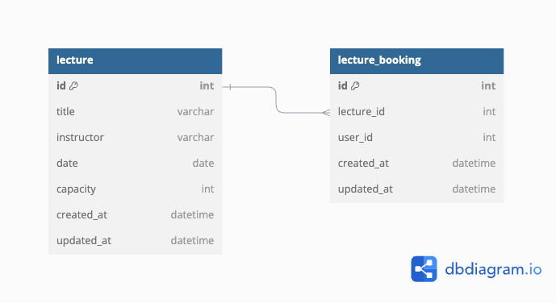

## ERD



### lecture

특강 테이블

```sql
Table lecture {

	id int [pk, increment]
	title varchar [note: '특강명']
	instructor varchar [note: '강연자 이름']
	date date [note: '특강 일자']
	capacity int [default: 30]
	created_at datetime [default: 'now()']
	updated_at datetime [default: 'now()']

}
```
- 특강의 기본 정보를 저장하는 테이블
- capacity 컬럼으로 최대 정원을 설정하며
    - 특강 신청이 완료되면 정원을 감소시키는 방식

### lecture_booking

특강 유저 신청 테이블

```sql
Table lecture_booking {

	id int [pk, increment]
	lecture_id int [ref: > lecture.id]
	user_id int
	created_at datetime [default: 'now()']
	updated_at datetime [default: 'now()']
	
}
```
- 특강 신청 데이터를 저장하는 테이블로, 사용자가 신청한 특강과 그 기록을 관리함

#### lecture와 lecture_booking 간의 관계

- 1:N 관계:
    - 하나의 특강(lecture)에 대해 여러 신청(lecture_booking)이 가능
    - 이를 구현하기 위해 lecture_booking.lecture_id가 lecture.id를 외래 키로 참조

- 물리적 설계
    - 성능 최적화를 위해 fk 제약조건은 설정하지 않음

